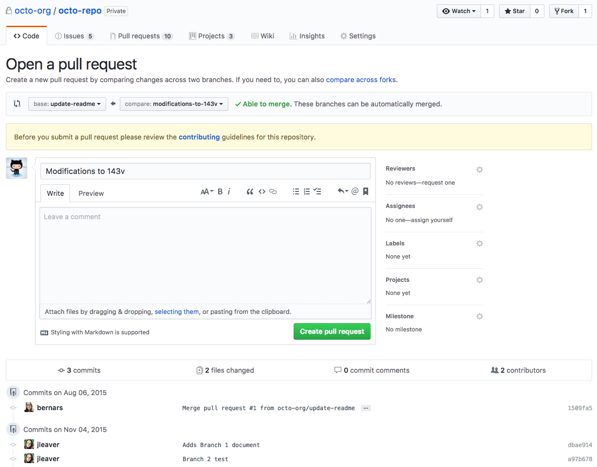

# Shared Repository Model Basic Branching Workflow

**This is not a doc about how to use git nor is this a project development model.
This is a doc on how I think branching can be incorporated more into our current workflow.**


## Background

From https://help.github.com/articles/about-collaborative-development-models/ : 
> In the shared repository model, collaborators are granted push access to a single shared repository and topic branches are created when changes need to be made. Pull requests are useful in this model as they initiate code review and general discussion about a set of changes before the changes are merged into the main development branch. This model is more prevalent with small teams and organizations collaborating on private projects.

### What is a branch?
A branch is a pointer to a commit. When you branch off a branch, you get a 'snapshot'. Having your own branch means you can commit to the code without affecting the original.

## Main branches

Suppose we are starting with a new project or jumping onto an existing project. There will exist a `master` branch and a parallel `dev` branch.

`origin/master` should be the branch where the HEAD points to code that is production-ready and deployable.
`origin/dev` should be the branch where HEAD points to code that is in a state with the latest development changes ready for the next release/merge with master.

Merges into `origin/master` should be major checkpoints where the project is ready to be deployed or major changes are ready to be added. Think code releases.

Never push directly to `master`. All changes to `master` should be from merging other branches into master. Because the `master` branch should be production-ready and deployable at any time, progress work should not be done here.


## Creating branches

You want to start writing code to add to the project. The emphasis of this doc is about **topic branches**. These short-lived branches should be used for bug fixes, features, or any specific work that takes some time. Name it something specific. Do not write something generic like `feature 23`. This makes it less clear what the branch is being used for.
 
Create your own branch using 
```
$ git branch localbranchname
```

To change to that branch or another existing branch, use
```
$ git checkout localbranchname
````

You write your code in the new branch and decide you are finished. You add and commit your work.
```
$ git add feature.py
$ git commit -m 'adding new feature'
```

If you have just created this new branch and it only exists locally, it will not have an upstream branch. An upstream branch is the branch that it pushes changes to. We want to set the remote as its upstream. So for first time pushes, use
```
$ git push --set-upstream origin localbranchname
```
This will create a remote (by default named 'origin') tracking branch of your local branch. There are other git commands to set the upstream branch, but I find this one to be the most convenient and straight-forward.

Setting the upstream is only done once, so after this you can just push using
```
$ git push
```
which pushes to its now set-up matching remote branch.

#### Other commands
```
$ git branch -a
```
to look at all branches (local + remote) and check current branch (the branch with an asterisk).


## Pull Requests

Now your code is pushed to the remote branch. You want your code to be merged into the dev branch. Before merging, we should ensure that our work is of sufficient quality. This is what pull requests are for. Rather than merging our own code, we submit a pull request on our commit(s) for a maintainer or a peer to approve our merge. A pull request is basically requesting for someone to *pull* in your changes. The end goal of a pull request is a merge.

Because we use GitHub here, we can open pull requests in the GitHub interface. There you can choose which branches to merge and the interface provides a nice space for tracking commits and feedback. After opening a pull request, you can push follow-up commits to make more changes until the pull request is closed.




**Note**: the git command `git request-pull` is not the same as a GitHub pull request. They have the same motivation, but different functionality.

From the git manual:
> Generate a request asking your upstream project to pull changes into their tree. The request, printed to the standard output, begins with the branch description, summarizes the changes and indicates from where they can be pulled.

So this function only generates a summary of pending changes ie. a text message. No merging is actually happening. 

With the library `hub` by GitHub, we can initialize pull requests in GitHub directly from the command line.

#### Other commmands
To merge a branch into your current branch without considering pull requests, simply use
```
$ git merge branchname
```

## Deleting branches

After your commits have been pulled and you are done with your topic branch, you can delete the remote branch using
```
$ git push -d origin branchname
```
and delete the local branch using
```
$ git branch -d branchname
``` 
You can choose to keep the local branch if you want but make sure to delete the remote branch once you are done with it to minimize clutter.

 
